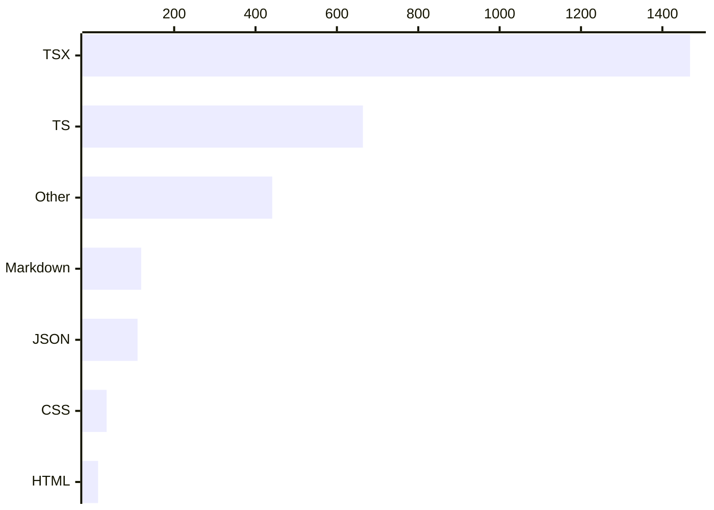

# By the numbers

A quantitative snapshot of the Corvex Console repository: size, activity, churn, and shape. All figures are computed from the Git history and tracked files only.

Data collected on 2026-09-21. Generated artifacts (`node_modules`, `dist`, `coverage`, `test-results`) and `package-lock.json` are excluded everywhere below.

## Size

The repository tracks 70 files totaling about 2,849 lines, of which roughly 2,132 lines are TypeScript/TSX. See [Overview](../overview/index.md) for what those files implement.

| Language / type | Files | Lines |
| --- | --- | --- |
| TSX (components, pages, tests) | 31 | 1,468 |
| TS (logic, config, mocks) | 18 | 664 |
| CSS | 1 | 34 |
| JSON (`package.json`, `tsconfig.json`) | 2 | 110 |
| Markdown (docs) | 4 | 119 |
| HTML (`index.html`) | 1 | 13 |
| Other (JS worker/configs, YAML, TOML, hooks) | 13 | ~441 |

File counts by role:

| Category | Count | Examples |
| --- | --- | --- |
| Application source (`src/` minus tests) | 48 | pages, components, store, mocks |
| Test files | 4 | `src/test/app.test.tsx`, `src/test/analytics.test.ts`, `src/test/setup.ts`, `e2e/smoke.spec.ts` |
| Config / tooling / docs (repo root) | 18 | `vite.config.ts`, `netlify.toml`, `.github/workflows/ci.yml`, `README.md` |

## Activity

All 18 commits carry timestamps on a single evening, 2026-09-21, between 22:18:44 and 22:27:52 -04:00. That is the complete activity history: one burst of about 9 minutes that walks from scaffold to deployment config. There is no earlier or later activity to chart.

### Churn hotspots

Most-changed files by cumulative lines added (via `git log --numstat`, `package-lock.json` excluded):

| File | Added | Deleted | Touches |
| --- | --- | --- | --- |
| `public/mockServiceWorker.js` (generated) | 361 | 0 | 1 |
| `src/config/brand.ts` | 144 | 3 | 2 |
| `src/pages/LandingPage.tsx` (deleted in HEAD refactor) | 139 | 139 | 2 |
| `src/pages/app/AssistantPage.tsx` | 137 | 0 | 1 |
| `src/pages/app/IntegrationsPage.tsx` | 123 | 0 | 1 |
| `src/test/app.test.tsx` | 111 | 1 | 2 |
| `src/layouts/ConsoleLayout.tsx` | 107 | 0 | 1 |
| `src/pages/app/ExplorerPage.tsx` | 107 | 0 | 1 |
| `src/pages/app/DashboardPage.tsx` | 103 | 0 | 1 |
| `src/mocks/handlers.ts` | 99 | 1 | 2 |

Most files were touched exactly once: written in the build burst and never edited again. The only files with real churn are the ones revisited by the final marketing refactor (`src/config/brand.ts`, the deleted `src/pages/LandingPage.tsx`, `src/mocks/handlers.ts`, `src/test/app.test.tsx`).

## Bot-attributed commits

18 of 18 commits (100%) carry a `Co-authored-by: factory-droid[bot]` trailer. Every commit is authored by the single human author RyanLauderback.

This trailer count is a lower bound on AI-assisted work: it only captures commits where the tool recorded itself as co-author. It says nothing about how much of each diff was machine-generated versus human-written, and the ~9-minute total commit span suggests heavy orchestration across the board.

## Complexity

### Average file size by top-level `src/` directory

| Directory | Files | Lines | Avg lines/file |
| --- | --- | --- | --- |
| `src/pages/` | 7 | 682 | 97 |
| `src/layouts/` | 2 | 156 | 78 |
| `src/test/` | 3 | 172 | 57 |
| `src/mocks/` | 4 | 184 | 46 |
| `src/marketing/` | 11 | 298 | 27 |
| `src/store/` | 2 | 50 | 25 |
| `src/lib/` | 4 | 84 | 21 |
| `src/components/` | 8 | 161 | 20 |

### Largest files

| File | Lines |
| --- | --- |
| `public/mockServiceWorker.js` (generated by MSW) | 361 |
| `src/config/brand.ts` | 141 |
| `src/pages/app/AssistantPage.tsx` | 137 |
| `src/pages/app/IntegrationsPage.tsx` | 123 |
| `src/test/app.test.tsx` | 110 |
| `src/pages/app/ExplorerPage.tsx` | 107 |
| `src/layouts/ConsoleLayout.tsx` | 107 |
| `src/pages/app/DashboardPage.tsx` | 103 |
| `src/mocks/handlers.ts` | 98 |

Excluding the generated service worker, the largest hand-written file is `src/config/brand.ts` at 141 lines. No application file exceeds 137 lines.

### Test-to-source ratio

Test code totals 207 lines across 4 files (`src/test/` plus `e2e/smoke.spec.ts`). Application source under `src/` totals 1,896 lines excluding tests. Ratio: roughly **0.11 test lines per source line** — thin unit coverage plus one Playwright smoke spec, consistent with a demo-grade project. See [How to contribute](../how-to-contribute/index.md) for how to run the suites.
