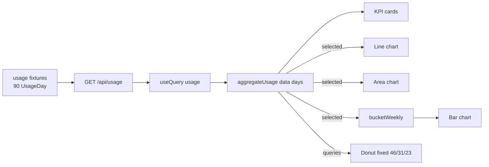

# Usage analytics

Active contributors: RyanLauderback

The analytics page renders workspace usage from a 90-day mocked time series through two pure transform functions into KPI cards and four Recharts visualizations, plus a static per-user table.

## Purpose

Show adoption and volume trends (queries, documents, tokens, active users) over a selectable 30/60/90-day window. All numbers come from the mock API; see [Mock API and data layer](mock-api.md).

## Key abstractions

| File | Description |
| --- | --- |
| `src/pages/app/AnalyticsPage.tsx` | Page component: range selector, KPI cards, charts, user table |
| `src/lib/analytics.ts` | Pure transforms `aggregateUsage` and `bucketWeekly` |
| `src/mocks/data.ts` | `usage`: 90 generated `UsageDay` entries starting 2024-10-01 |
| `src/lib/api.ts` | `api.usage()` GET client |
| `src/lib/utils.ts` | `formatNumber` for KPI display |

## How it works

`useQuery(["usage"])` fetches the full 90-day series once; the date-range `<select>` (`data-testid="analytics-range"`, values 30/60/90) only changes local state, so switching ranges never refetches. Two memos derive everything else:

### `aggregateUsage(data, days)`

Defined in `src/lib/analytics.ts`. Takes the last `days` entries via `data.slice(-days)` (the tail of the array is the most recent dates) and returns:

- `selected`: the sliced array, used directly by the line and area charts.
- `queries`, `documents`, `tokens`: sums over the window.
- `averageUsers`: mean of `activeUsers` across the window, rounded; `0` if the window is empty.

### `bucketWeekly(data)`

Also pure. Groups the selected days into consecutive 7-day chunks by array position (`Math.floor(index / 7)`), not by calendar week. Each bucket is labeled with the `MM-DD` slice of its first day's date and sums `queries` and `documents`. The bar chart plots `documents` per bucket.

### Charts (Recharts)

- **Query volume**: `LineChart` of daily `queries` over `selected`.
- **Documents accessed**: `BarChart` of weekly buckets from `bucketWeekly`.
- **Token consumption**: `AreaChart` of daily `tokens` with a gradient fill.
- **Queries by product**: donut (`PieChart` with inner/outer radius) whose three segments are fixed percentages of total queries: Generative search 46%, Assistant 31%, Agents 23%. These shares are hardcoded, not derived from data.

Each KPI card also shows a static "↑ vs previous period" line; no previous-period comparison is computed.

### Per-user table

A hardcoded `users` array in the page component (Maya Chen, James Okafor, Sofia Rossi, Theo Martin, Nina Gupta) with role, query/document counts, and last-active labels. It does not come from the API and does not respond to the date range.

### The fixtures

`usage` in `src/mocks/data.ts` generates 90 days from `Date.UTC(2024, 9, 1 + index)` (2024-10-01 through late December 2024). Values are deterministic: a sine wave (`Math.sin(index / 6) * 10`) plus modular offsets, with tokens growing linearly (`18500 + index * 142`).

## Integration points

- Routed at `/app/analytics` inside the authenticated console (see [Authentication](authentication.md)).
- The `UsageDay` shape is defined in `src/types/index.ts`; see [Data models](../reference/data-models.md).
- Brand chart colors (`#356df3`, `#56d6b1`, `#8b5cf6`) mirror the brand palette; see [Brand system](brand-system.md).

## Entry points for modification

- Change the series: edit the generator in `src/mocks/data.ts`.
- Add a metric: extend `UsageDay`, the generator, `aggregateUsage`, and add a card/chart.
- Make the donut data-driven: replace the fixed 0.46/0.31/0.23 multipliers.
- True calendar-week bucketing: replace the index-based `Math.floor(index / 7)` grouping.

## Key source files

| File | Role |
| --- | --- |
| `src/pages/app/AnalyticsPage.tsx` | Page, charts, static user table |
| `src/lib/analytics.ts` | `aggregateUsage`, `bucketWeekly` |
| `src/mocks/data.ts` | 90-day `usage` fixtures |
| `src/lib/api.ts` | `usage` client |
| `src/types/index.ts` | `UsageDay` type |
