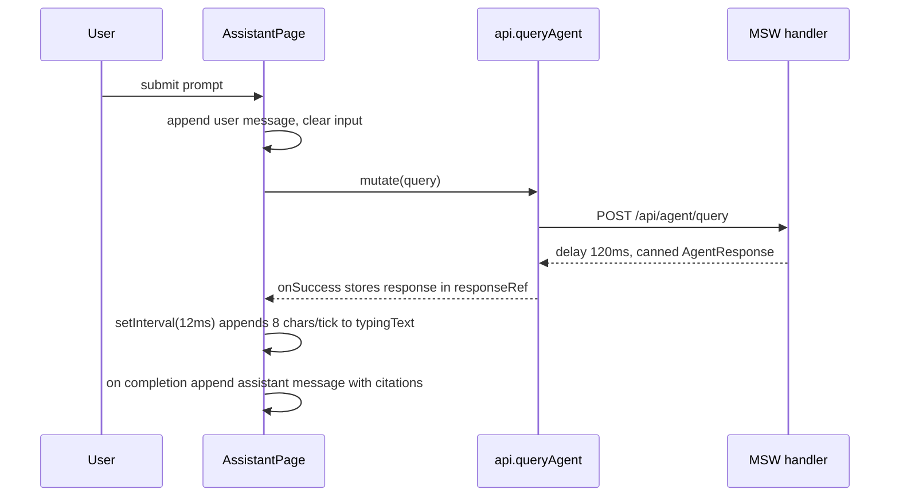

# AI assistant

Active contributors: RyanLauderback

The assistant page is a chat interface that sends research questions to a mocked agent endpoint and plays back the canned answer with a simulated typewriter effect. All state is local component state; nothing persists across reloads.

## Purpose

Let users ask natural-language questions and receive an answer grounded in citations that link back into the document explorer. In this demo every answer is a template string returned by MSW, so the page demonstrates interaction patterns (streaming, citations, pending states) rather than real inference.

## Key abstractions

| File | Description |
| --- | --- |
| `src/pages/app/AssistantPage.tsx` | The whole feature: sidebar, message list, streaming effect, input form |
| `src/mocks/handlers.ts` | `POST /api/agent/query` handler (120ms delay, canned answer, 3 citations) |
| `src/mocks/data.ts` | `conversations` fixtures for the sidebar (3 static entries) |
| `src/lib/api.ts` | `api.queryAgent(query)` typed POST client |
| `src/config/brand.ts` | `brand.console.quickPrompts` suggested prompt copy |
| `src/types/index.ts` | `AgentResponse` type: `{ answer, citations: { id, title }[] }` |

## How it works

Behavior details:

- **Conversation sidebar**: renders the static `conversations` array from `src/mocks/data.ts`. The buttons are decorative; clicking one does not load a thread. The "New chat" button (`data-testid="new-chat"`) clears messages, typing text, the response ref, and calls `mutation.reset()`.
- **Suggested prompts**: on an empty thread the empty state renders `brand.console.quickPrompts` as cards; clicking one prefills the input rather than sending immediately.
- **Streaming**: `onSuccess` stores the `AgentResponse` in `responseRef` and resets `typingText`. A `useEffect` then runs `setInterval` every 12ms, appending 8 characters per tick from `response.answer` into `typingText`. When the full answer is revealed, the interval clears and the message (with citations) is appended to the messages array.
- **Pending state**: while the mutation is in flight or text is streaming, a typing row (`data-testid="assistant-typing"`) shows "Reviewing connected sources…" or the partial text. `send()` is a no-op while `mutation.isPending` or a response is still streaming, so only one exchange is in flight at a time.
- **Citations**: each assistant message renders its citations as `[n] title` links (`data-testid="assistant-citations"`) pointing to `/app/explorer?document=<id>`, which the explorer page uses to open the document viewer. See [Explorer](explorer.md).
- **Prompt prefill**: the input initializes from `?prompt=` via `useSearchParams`, so other pages can deep-link a pre-filled question.

### The mock agent endpoint

`POST /api/agent/query` in `src/mocks/handlers.ts` reads `{ query }` from the body, waits 120ms, and returns an answer template that interpolates the lowercased query plus the first three documents from `src/mocks/data.ts` as citations. There is no query understanding; any input yields the same shape of response.

## Integration points

- Routed at `/app/assistant` inside `ConsoleLayout`, guarded by `RequireAuth` (see [Authentication](authentication.md)).
- Citation links depend on the explorer page's `?document=` handling (see [Explorer](explorer.md)).
- Data layer details are in [Mock API and data layer](mock-api.md).

## Known gap

`ExplorerPage` links to `/app/assistant?document=<id>` to ask about a document, but `AssistantPage` only reads the `prompt` query param. Following that link opens the assistant with an empty input; the document id is ignored.

## Entry points for modification

- Change streaming speed: the `12`ms interval and `position += 8` step in the `useEffect`.
- Change answers: the template string in the `/api/agent/query` handler.
- Add real conversation history: replace the static `conversations` render and wire `newChat` / selection to state.
- Handle `?document=`: read the param alongside `prompt` to close the explorer deep-link gap.

## Key source files

| File | Role |
| --- | --- |
| `src/pages/app/AssistantPage.tsx` | Page component and streaming logic |
| `src/mocks/handlers.ts` | `/api/agent/query` mock |
| `src/mocks/data.ts` | Sidebar conversation fixtures |
| `src/lib/api.ts` | `queryAgent` client |
| `src/config/brand.ts` | Suggested prompt copy |
