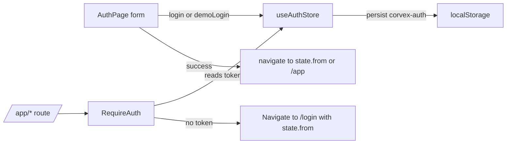

# Authentication

Active contributors: RyanLauderback

Authentication is intentionally fake: any non-empty email and password "signs in", a demo button logs in a fixed persona, and a static token is persisted to localStorage. It exists only to demonstrate guarded routing and must never be adapted for production use.

## Purpose

The auth feature provides `/login` and `/signup` pages, a Zustand session store, and a `RequireAuth` guard that protects every `/app/*` route. It simulates a real session flow (redirect to login, return to the originally requested page) without any backend.

## Key abstractions

| Abstraction | File | Description |
| --- | --- | --- |
| `AuthPage` | `src/pages/AuthPage.tsx` | Two-mode (`login` / `signup`) form page with a demo-login button and a brand side panel. |
| `useAuthStore` | `src/store/auth.ts` | Zustand store with `token`, `user`, `login`, `demoLogin`, `logout`, persisted under the localStorage key `corvex-auth`. |
| `RequireAuth` | `src/components/RequireAuth.tsx` | Route guard that redirects to `/login` with `state.from` when no token exists. |
| `User` | `src/types/index.ts` | User shape: id, name, email, company, plan. |

## How it works

`src/pages/AuthPage.tsx` uses React Hook Form with a Zod resolver. The schema requires a valid email and a non-empty password; `name` is optional and only rendered in signup mode. Titles come from `brand.auth` (`loginTitle`, `signupTitle`, `demoLabel`). The right-hand panel (visible at `lg` and up) shows `brand.company`, `brand.tagline`, `brand.description`, and three hard-coded stat tiles on the `ink` background. Inputs carry `data-testid` attributes (`demo-login`, `email-input`, `password-input`, `auth-submit`) used by the test suite.

`src/store/auth.ts` is a Zustand store wrapped in `persist` with the key `corvex-auth`. `login(email, password)` only checks that both fields are non-blank, then sets a static token string `corvex_demo_token` and a derived user: emails starting with `demo` become "Maya Chen", otherwise the name is the email local-part. `demoLogin()` sets the same token with the fixed persona Maya Chen (`demo@corvex.example`, Northstar Capital, Professional plan). `logout()` clears both fields; the persisted entry is what keeps a user "signed in" across reloads. The token is not a real JWT and is never validated.

`src/components/RequireAuth.tsx` reads `token` from the store. If present it renders `<Outlet />`; otherwise it renders `<Navigate to="/login" replace state={{ from: location.pathname }} />`. `AuthPage` reads that state back as `(location.state as { from?: string } | null)?.from || "/app"` and navigates there after a successful login, completing the redirect loop. Note `demoLogin` always navigates to `/app` directly.

## Safety warning

There is no credential verification, no server round-trip, no token expiry, and the "secret" lives in localStorage. Do not reuse this code as the basis for a real auth system; replace it wholesale with a real identity provider.

## Integration points

- [Dashboard](dashboard.md) and other console pages read `user` from `useAuthStore` for personalization.
- The [marketing site](marketing-site.md) links to `/login` and `/signup` from `PublicLayout` and every CTA.
- Route wiring (`RequireAuth` around `ConsoleLayout`) lives in `src/App.tsx`; see [System architecture](../overview/architecture.md).

## Entry points for modification

- Change form fields or validation: edit the Zod schema in `src/pages/AuthPage.tsx`.
- Change the demo persona or persistence key: edit `src/store/auth.ts`.
- Change guard behavior (for example, redirect target): edit `src/components/RequireAuth.tsx`.

## Key source files

| File | Role |
| --- | --- |
| `src/pages/AuthPage.tsx` | Login/signup form with demo button. |
| `src/store/auth.ts` | Fake session store persisted to localStorage. |
| `src/components/RequireAuth.tsx` | Guard for `/app/*` routes. |
| `src/config/brand.ts` | Auth titles and demo-button label (`brand.auth`). |
| `src/types/index.ts` | `User` type. |
