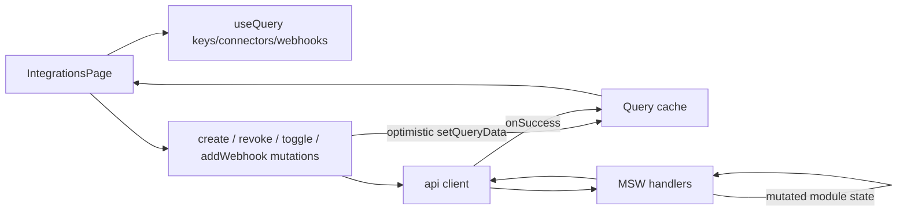

# Integrations and API keys

Active contributors: RyanLauderback

The integrations page manages API keys, connectors, webhooks, and developer onboarding snippets against the MSW mock API. It is the heaviest consumer of TanStack Query mutations in the app, including two optimistic-update flows with rollback.

## Purpose

Give a workspace the surface area to authenticate server-side apps (API keys), connect third-party data sources (connectors), subscribe to events (webhooks), and copy starter code. All data comes from the mock API; see [Mock API and data layer](mock-api.md).

## Key abstractions

| File | Description |
| --- | --- |
| `src/pages/app/IntegrationsPage.tsx` | Page component: key table, dialogs, connector cards, webhook form |
| `src/lib/api.ts` | `keys`, `createKey`, `revokeKey`, `connectors`, `toggleConnector`, `webhooks`, `createWebhook` |
| `src/mocks/handlers.ts` | GET/POST/DELETE `/api/keys`, GET/POST `/api/connectors`, GET/POST `/api/webhooks` |
| `src/mocks/data.ts` | `initialKeys` (4), `initialConnectors` (5), `initialWebhooks` (1) |
| `src/components/ui/dialog.tsx` | Dialog used for create and reveal-once secret modals |

## How it works

### API keys

- `useQuery(["keys"])` populates a table (`data-testid="key-table"`) with name, masked prefix (`prefix` + `••••`), created date, and last-used label.
- **Create flow**: "Create API key" opens a name dialog (`data-testid="create-key-open"`). Submitting calls `api.createKey(name)`; the mock handler mints a key with prefix `cvx_live_<NNNN>` and a `secret` field. `onSuccess` prepends the key to the `["keys"]` cache via `setQueryData` and stores the secret in local state, which opens a second dialog showing the secret once (`data-testid="key-secret"`) with a copy button that writes to `navigator.clipboard`. Closing that dialog clears the secret from state, so it cannot be shown again.
- **Revoke flow**: the trash button (`data-testid="revoke-<id>"`) runs an optimistic mutation: `onMutate` cancels in-flight queries, snapshots the previous list, removes the key from cache; `onError` restores the snapshot; `onSettled` invalidates `["keys"]`. Because the mock DELETE never fails, rollback is a safety net rather than a visible behavior.

### Connectors

Five cards from `initialConnectors` in `src/mocks/data.ts`: Slack, Snowflake, Salesforce, Google Drive, Amazon S3 (Slack and Drive start `connected`). Clicking Connect/Connected runs an optimistic toggle: `onMutate` flips the card's status in cache, `onError` rolls back, and `onSuccess` replaces the cache with the full connector array returned by `POST /api/connectors`.

### MCP server card

A static "Model Context Protocol" card shows a Corvex MCP server endpoint (`https://mcp.corvex.example/sse`), a Radix Switch (`data-testid="mcp-toggle"`, `defaultChecked`, not wired to any store or API), and a JSON config snippet for `mcpServers`. It is presentational only.

### Quick start snippets

A tabbed card switches between three hardcoded snippets (`curl`, `Python`, `TypeScript`) showing how to call a fictional Corvex search API. Purely static strings in the page component.

### Webhooks

An input plus "Add webhook" button posts the URL to `/api/webhooks`; the mock appends `{ url, event: "document.created", active: true }` and returns the full list, which `onSuccess` writes into the `["webhooks"]` cache. Existing webhooks render as a URL plus an event badge. The seed list has one entry (`research.completed`).

## Integration points

- Routed at `/app/integrations` inside the authenticated console (see [Authentication](authentication.md)).
- Key/connector/webhook shapes come from `src/types/index.ts`; see [Data models](../reference/data-models.md).
- Test patterns for these mutations are covered in [Testing](../how-to-contribute/testing.md).

## Entry points for modification

- Add a connector: append to `initialConnectors` in `src/mocks/data.ts`; the card grid renders automatically.
- Change key generation: edit the `POST /api/keys` handler (prefix suffix derives from `keys.length + 31`).
- Wire the MCP toggle: connect the Switch to state or an endpoint; it currently does nothing.
- Add webhook deletion: the API has no DELETE for webhooks; add a handler and a mutation mirroring the revoke flow.

## Key source files

| File | Role |
| --- | --- |
| `src/pages/app/IntegrationsPage.tsx` | Page component and all four mutations |
| `src/lib/api.ts` | Typed client methods |
| `src/mocks/handlers.ts` | Keys, connectors, webhooks endpoints |
| `src/mocks/data.ts` | Seed fixtures |
| `src/types/index.ts` | `ApiKey`, `Connector`, `Webhook` types |
