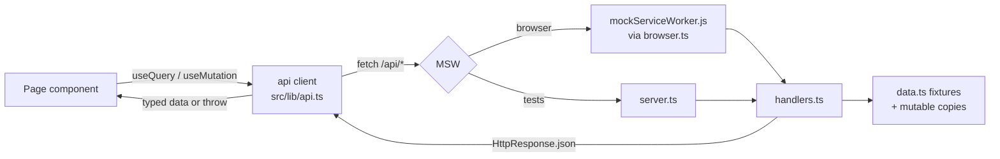

# Mock API and data layer

Active contributors: RyanLauderback

Corvex Console has no backend. Every network request is intercepted by MSW (Mock Service Worker) and answered from deterministic fixtures, giving the app production-shaped data flow (fetch, caching, optimistic mutations, error handling) that runs entirely in the browser or in tests.

## Purpose

Simulate a REST API with realistic shapes, latency, and mutable state so the UI behaves like it would against a real service, without any server. This is the foundation under every console page: [Dashboard](dashboard.md), [Explorer](explorer.md), [AI assistant](assistant.md), [Integrations and API keys](integrations.md), [Usage analytics](analytics.md), and [Settings](settings.md).

## Directory layout

| Path | Description |
| --- | --- |
| `src/mocks/data.ts` | Seed fixtures: documents, usage series, keys, connectors, webhooks, conversations |
| `src/mocks/handlers.ts` | All request handlers plus mutable module state and `resetMockData()` |
| `src/mocks/browser.ts` | `setupWorker` for the dev/browser runtime |
| `src/mocks/server.ts` | `setupServer` for Node (Vitest) |
| `public/mockServiceWorker.js` | The MSW service worker script served at the root |
| `src/lib/api.ts` | Typed fetch client used by every page |
| `src/types/index.ts` | Shared request/response types |

## How it works



### Startup

`src/main.tsx` starts the worker when `VITE_ENABLE_MOCKS=true`, calling `worker.start()` before rendering `src/App.tsx`. Tests use `src/mocks/server.ts` instead; see [Testing](../how-to-contribute/testing.md) for how `resetMockData()` is called between tests.

### Mutable state and reset

`src/mocks/handlers.ts` holds module-level copies of the seed arrays:

```ts
let keys = initialKeys.map((key) => ({ ...key }));
```

The same pattern applies to `connectors` and `webhooks`. POST/DELETE handlers mutate these copies, so created keys and webhooks persist for the life of the page (a refresh resets them, since fixtures are immutable). `resetMockData()` re-clones the seeds; tests call it to isolate cases. Documents and usage are never mutated and are served directly from the fixtures.

### Frozen demo clock

The `range` filter on `GET /api/documents` anchors "now" to the literal date `2024-12-31` in `src/mocks/handlers.ts`, not `Date.now()`. A document passes if its date is within `range` days before that anchor. This keeps the demo stable: the fixtures (2024 dates) always look recent relative to the anchor.

## Endpoint reference

| Method | Path | Behavior |
| --- | --- | --- |
| GET | `/api/me` | Returns the demo user (Maya Chen, Northstar Capital, plan "Professional") |
| GET | `/api/usage` | Returns the full 90-day `usage` array |
| GET | `/api/documents` | Filters by `q` (title/excerpt/company substring, case-insensitive), `sector`, `source`, and `range` (days back from 2024-12-31, `all` disables) |
| GET | `/api/documents/:id` | One document, or 404 `{ message: "Not found" }` |
| POST | `/api/agent/query` | 120ms delay, then a canned answer interpolating the query plus the first 3 documents as citations |
| GET | `/api/keys` | Current key list |
| POST | `/api/keys` | Creates a key (`cvx_live_<NNNN>` prefix, reveal-once `secret`), prepends it, returns 201 |
| DELETE | `/api/keys/:id` | Removes the key, returns `{ success: true }` |
| GET | `/api/connectors` | Current connector list |
| POST | `/api/connectors` | Toggles one connector's status (`connected` ↔ `available`), returns the full list |
| GET | `/api/webhooks` | Current webhook list |
| POST | `/api/webhooks` | Appends `{ url, event: "document.created", active: true }`, returns the full list |

## Seed data scale (`src/mocks/data.ts`)

- **Documents**: 40 generated from a cross-product of 8 companies, 4 source types, and 5 themes, with 2024 dates. Realistic `title`, `excerpt`, three-paragraph `body`, and `tags`.
- **Usage**: 90 `UsageDay` entries from 2024-10-01, values from a sine wave plus modular offsets.
- **API keys**: 4 seeds (`key-1` through `key-4`), mixed `cvx_live_` / `cvx_test_` prefixes.
- **Connectors**: 5 (Slack, Snowflake, Salesforce, Google Drive, Amazon S3); Slack and Drive start connected.
- **Webhooks**: 1 seed (`research.completed`).
- **Conversations**: 3 sidebar fixtures for the assistant page.

## The API client (`src/lib/api.ts`)

A single `request<T>` helper wraps `fetch`, sets `Content-Type: application/json`, throws `Error("Request failed: <status>")` on any non-OK response, and returns `response.json()` typed as `T`. The exported `api` object maps one method per endpoint (`me`, `usage`, `documents`, `document`, `queryAgent`, `keys`, `createKey`, `revokeKey`, `connectors`, `toggleConnector`, `webhooks`, `createWebhook`). Pages never call `fetch` directly; TanStack Query wraps these methods, and mutations pair them with optimistic `setQueryData` updates and rollback.

## Types (`src/types/index.ts`)

`User`, `Document`, `UsageDay`, `ApiKey` (with optional reveal-once `secret`), `Connector` (`connected | available`), `Webhook`, and `AgentResponse` (`answer` plus `{ id, title }` citations). Field-by-field shape documentation lives in [Data models](../reference/data-models.md); this page covers how the data behaves.

## Integration points

- Enabled via `VITE_ENABLE_MOCKS` at startup in `src/main.tsx`; see [Architecture](../overview/architecture.md).
- Test setup uses `src/mocks/server.ts` and `resetMockData()`; see [Testing](../how-to-contribute/testing.md).
- Every console feature page consumes these endpoints through `src/lib/api.ts`.

## Entry points for modification

- Add an endpoint: add a handler in `src/mocks/handlers.ts`, a typed method in `src/lib/api.ts`, and a type in `src/types/index.ts` if needed. Both browser worker and test server pick it up automatically since they share `handlers`.
- Add fixture data: edit `src/mocks/data.ts`; remember handlers serve mutable copies, so new seeded keys/connectors/webhooks appear after `resetMockData()` or a refresh.
- Add latency or failure modes: use `delay()` or return non-OK `HttpResponse` in a handler to exercise error/rollback paths.
- Change the demo clock: the `2024-12-31` literal in the documents handler.

## Key source files

| File | Role |
| --- | --- |
| `src/mocks/handlers.ts` | All endpoints, mutable state, `resetMockData()` |
| `src/mocks/data.ts` | Seed fixtures |
| `src/mocks/browser.ts` | Browser worker |
| `src/mocks/server.ts` | Node test server |
| `public/mockServiceWorker.js` | Service worker script |
| `src/lib/api.ts` | Typed fetch client |
| `src/types/index.ts` | Shared types |
