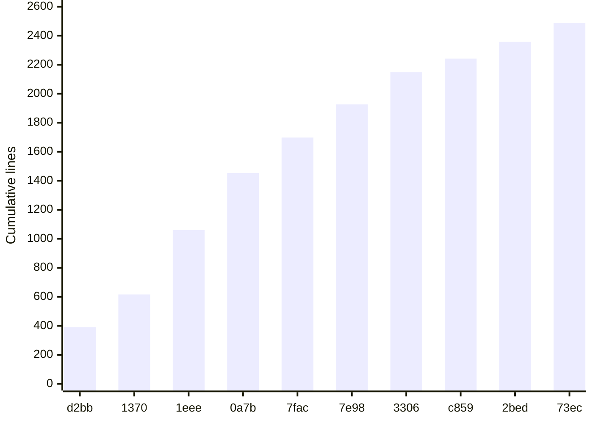

# Lore

The history of Corvex Console as told by its Git log. The honest summary: there is exactly one era, and it lasted about nine minutes.

## Eras

### The initial build (2026-09-21, 22:18:44 to 22:27:52 -04:00)

All 18 commits were created on a single evening, 2026-09-21, between 22:18:44 and 22:27:52 -04:00. There are no earlier or later commits, no tags, and no merges. Within that burst, the commit sequence falls into four recognizable phases:

**Phase 1: Scaffold and tooling (22:18:44 - 22:18:50)**

- `d2bbcad` chore: scaffold Vite React application (22:18:44)
- `713cea0` chore: configure linting and commit hooks (22:18:47)
- `1370181` feat: add centralized brand system (22:18:50)

**Phase 2: Product features (22:18:56 - 22:19:27)**

- `50c3e33` feat: build marketing and pricing pages (22:18:56)
- `1eee2fc` feat: add MSW mock API and seed data (22:19:00)
- `396b114` feat: add mock authentication and session state (22:19:05)
- `0a7b66b` feat: add console shell and dashboard (22:19:09)
- `04f1b34` feat: add searchable data explorer (22:19:14)
- `7fac9bd` feat: add cited AI research assistant (22:19:16)
- `1c3bafe` feat: add API MCP and connector management (22:19:19)
- `7e98b36` feat: add usage analytics visualizations (22:19:22)
- `ab5bb26` feat: add organization settings page (22:19:27)

**Phase 3: Quality gates and release plumbing (22:19:33 - 22:19:50)**

- `330617f` test: add unit and component coverage (22:19:33)
- `4c8c8d4` test: add Playwright smoke workflow (22:19:37)
- `c85953c` ci: add GitHub quality workflow (22:19:40)
- `635f1dd` chore: configure Netlify deployment (22:19:44)
- `2bed7fa` docs: add project and contribution guides (22:19:50)

**Phase 4: Marketing refactor (22:27:52)**

- `73ece1e` refactor: align marketing architecture and pricing (22:27:52) — HEAD

The gap between Phase 3 (ending 22:19:50) and Phase 4 (22:27:52) is about 8 minutes, longer than the entire rest of the history combined.

## Longest-standing features

Everything is equally young. The oldest code in the repository is the scaffold commit `d2bbcad` (2026-09-21 22:18:44), and no part of the tree is more than about nine minutes older than any other part. Files like `index.html`, `package.json`, and `src/main.tsx` trace to that root commit; most feature files were written once in Phase 2 and never edited again.

## Major rewrites

There has been one: HEAD commit `73ece1e` "refactor: align marketing architecture and pricing" (2026-09-21 22:27:52), which touched 19 files with +315/-184 lines.

Before this commit, the landing and pricing experiences lived in two monolithic page components, `src/pages/LandingPage.tsx` (139 lines, now deleted) and `src/pages/PricingPage.tsx`. The refactor replaced them with a composed marketing architecture:

- `src/marketing/Landing.tsx` and `src/marketing/Pricing.tsx` as thin page-level compositions
- `src/marketing/PricingTierCard.tsx` plus reusable sections under `src/marketing/sections/`: `Hero.tsx`, `LogoCloud.tsx`, `FeatureGrid.tsx`, `ProductPreview.tsx`, `Testimonial.tsx`, `PricingTeaser.tsx`, `CTA.tsx`, `Footer.tsx`
- Plan metadata centralized in `src/config/brand.ts` so pricing tiers are defined once and reused

`src/App.tsx`, `src/mocks/handlers.ts`, and `src/test/app.test.tsx` were adjusted to match. The result is visible in the [by the numbers](by-the-numbers.md) page: `src/marketing/` files average 27 lines each, versus 97 for the remaining `src/pages/` files.

## Growth trajectory

Cumulative tracked lines after each commit (excluding `package-lock.json` and the generated `public/mockServiceWorker.js`), computed from `git show --numstat`:

| Commit | Cumulative lines |
| --- | --- |
| `d2bbcad` scaffold | 391 |
| `713cea0` linting/hooks | 423 |
| `1370181` brand system | 616 |
| `50c3e33` marketing pages | 837 |
| `1eee2fc` MSW mock API | 1,061 |
| `396b114` auth/session | 1,201 |
| `0a7b66b` console shell | 1,454 |
| `04f1b34` explorer | 1,561 |
| `7fac9bd` assistant | 1,698 |
| `1c3bafe` integrations | 1,821 |
| `7e98b36` analytics | 1,927 |
| `ab5bb26` settings | 1,976 |
| `330617f` unit tests | 2,148 |
| `4c8c8d4` e2e workflow | 2,203 |
| `c85953c` CI workflow | 2,242 |
| `635f1dd` Netlify | 2,254 |
| `2bed7fa` docs | 2,358 |
| `73ece1e` marketing refactor | 2,489 |

Growth is monotonic and almost perfectly linear through the feature phase: each feature commit added a roughly constant slice of 100-250 lines, and even the HEAD refactor netted +131 lines despite deleting two pages.

## Date oddities

The record contradicts itself, factually:

- Every Git commit is dated **2026-09-21**, in a ~9-minute window.
- `CHANGELOG.md` dates release **0.1.0 as 2025-01-15**, more than a year before the repository's first commit.
- `package.json` agrees with the changelog on the version number (0.1.0) but has no date.

So the version history claims the app shipped in January 2025, while the commit history claims it did not exist until September 2026. Both cannot be true; the changelog date is best read as fictional framing for the demo, and the commit dates as the environment clock at build time. See [Fun facts](fun-facts.md) for related anomalies.
