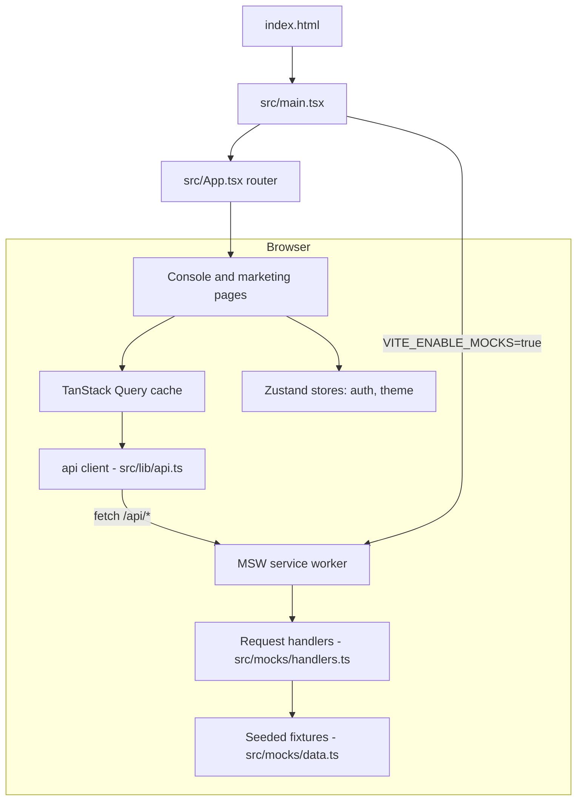

# Architecture

Corvex Console is a single static SPA with no server-side runtime. The browser bundle contains the entire application, the router, the state stores, and the mock API layer. MSW intercepts `fetch` calls before they leave the browser, so the app behaves like it has a backend while remaining fully static and deployable to any CDN.

## System diagram

## Bootstrap sequence

1. `index.html` loads `src/main.tsx`.
2. `src/main.tsx` calls `enableMocking()`, which starts the MSW browser worker (`src/mocks/browser.ts`, served from `public/mockServiceWorker.js`) when `import.meta.env.VITE_ENABLE_MOCKS === "true"`. The flag is inlined at build time by the `define` block in `vite.config.ts`, and defaults to `"true"`.
3. React mounts `<App/>` in `StrictMode`. `src/App.tsx` wraps the router in `QueryClientProvider` using the shared client from `src/lib/query-client.ts` (retry disabled, 30-second stale time).

## Routing

The entire route table lives in `src/App.tsx`:

- **Public** (`/` and `/pricing`) render inside `PublicLayout` (`src/layouts/PublicLayout.tsx`), which provides the marketing header and footer.
- **Auth** (`/login`, `/signup`) render the standalone `AuthPage` (`src/pages/AuthPage.tsx`).
- **Console** (`/app/*`) is wrapped by `RequireAuth` (`src/components/RequireAuth.tsx`), which redirects tokenless visitors to `/login` and preserves the intended destination. Inside the guard, `ConsoleLayout` (`src/layouts/ConsoleLayout.tsx`) renders the dark sidebar and hosts the six console pages.
- The catch-all route `*` renders the landing page rather than a 404.

## Data flow

Reads follow one path: a page calls `useQuery` with a typed function from `src/lib/api.ts`, the fetch is intercepted by an MSW handler in `src/mocks/handlers.ts`, and the handler returns fixture data from `src/mocks/data.ts`. Mutations (create or revoke an API key, toggle a connector, add a webhook) use `useMutation` with optimistic `setQueryData` cache writes and rollback on error; MSW keeps mutable copies of fixtures in module scope, and `resetMockData()` restores them between tests.

## Client state

Two persisted Zustand stores hold everything the mock API does not:

- `src/store/auth.ts` — the fake session (`localStorage` key `corvex-auth`). `login()` accepts any email plus nonempty password and issues a `corvex_demo_token`; `demoLogin()` signs in a fixed demo persona.
- `src/store/theme.ts` — the dark-mode flag (`corvex-theme`), applied to the document root by the settings page.

## Cross-page flows

The console pages hand context to each other through query parameters: dashboard quick prompts link to `/app/assistant?prompt=...`, and assistant citations link back to `/app/explorer?document=<id>`, which the explorer reads via `useSearchParams` to preselect a document.

## Key source files

| File | Purpose |
| --- | --- |
| `src/main.tsx` | Entry point; starts MSW, mounts React |
| `src/App.tsx` | Route table and React Query provider |
| `src/lib/api.ts` | Typed `fetch` wrapper for all endpoints |
| `src/mocks/handlers.ts` | Every mock endpoint plus mutable state |
| `src/mocks/data.ts` | Deterministic seed fixtures |
| `src/store/auth.ts` | Fake session store |
| `src/components/RequireAuth.tsx` | Console route guard |
| `vite.config.ts` | Build config, path alias, mock flag, Vitest config |

For per-feature detail, see [Features](../features/index.md). For how the mock endpoints behave, see [Mock API and data layer](../features/mock-api.md).
